# Expense Planner

A new Flutter project.

**Features:**

- Save Data to Local Storage
- Last Week Expense Chart
- Delete Transactions

Our Expense Planner application contains single screen and a special feature of RealTime visualization of Last 7 days, 15 days and 30 Days Expences.
User can delete the Expense any time they want.

This is a complete functional application that works on both Android and iOS devices.

# Expense Planner App Final UI

**Home Screen**

<tr>
<td>
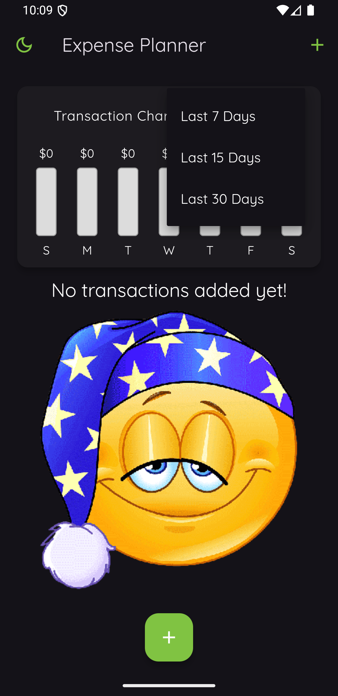
</td>
<td>
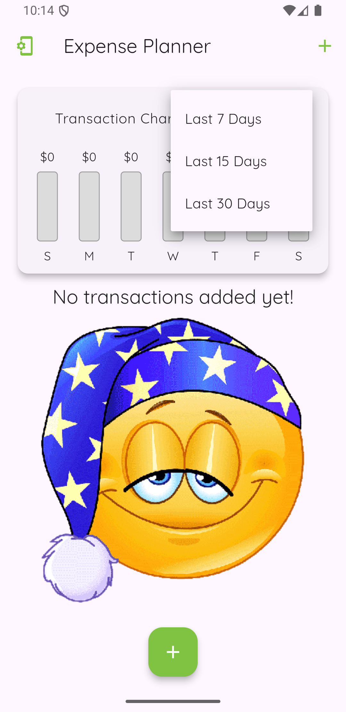
</td>
</tr>

**Input Screen**
 

<tr>
<td>
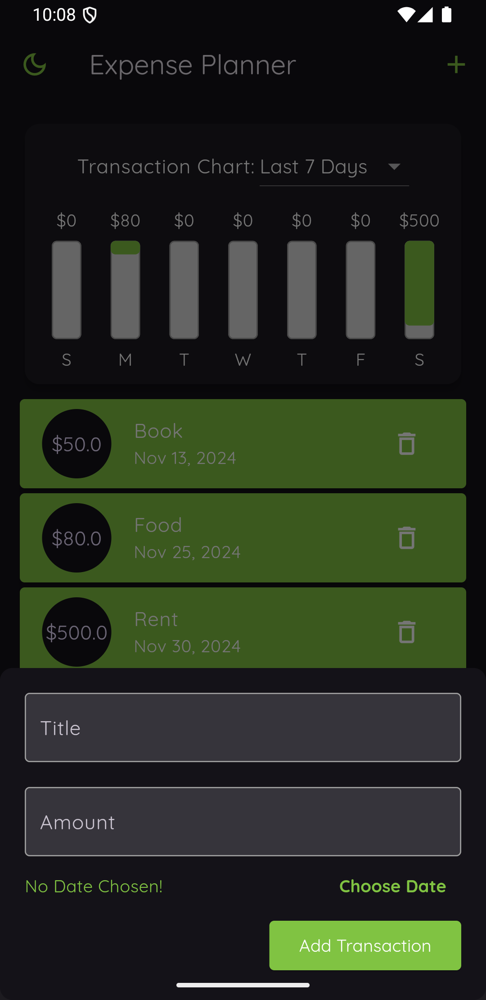
</td>
<td>
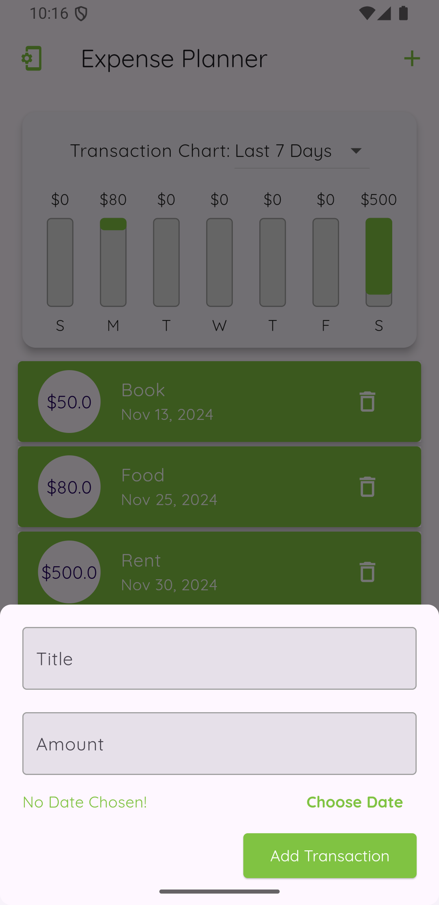
</td>
</tr>

**Data View Screen**
 

<tr>
<td>
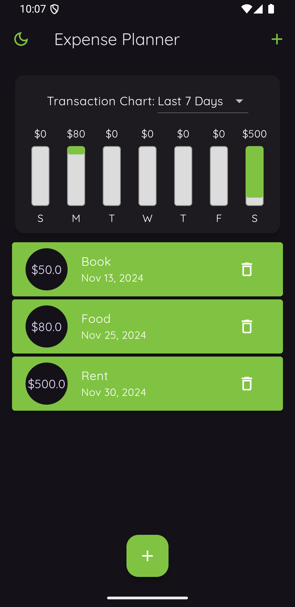
</td>
<td>
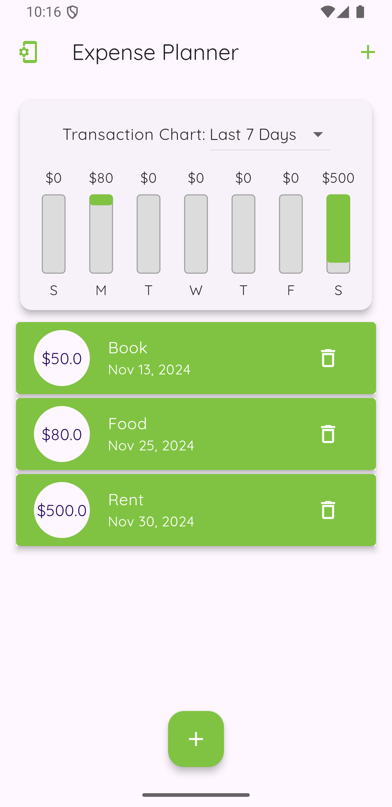
</td>
</tr>

**Theme Selection**

 
<tr>
<td>
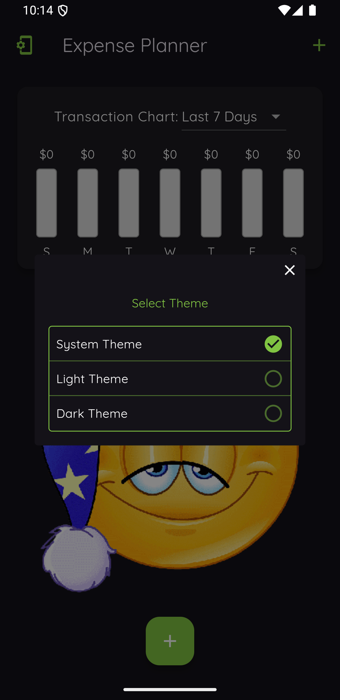
</td>
<td>
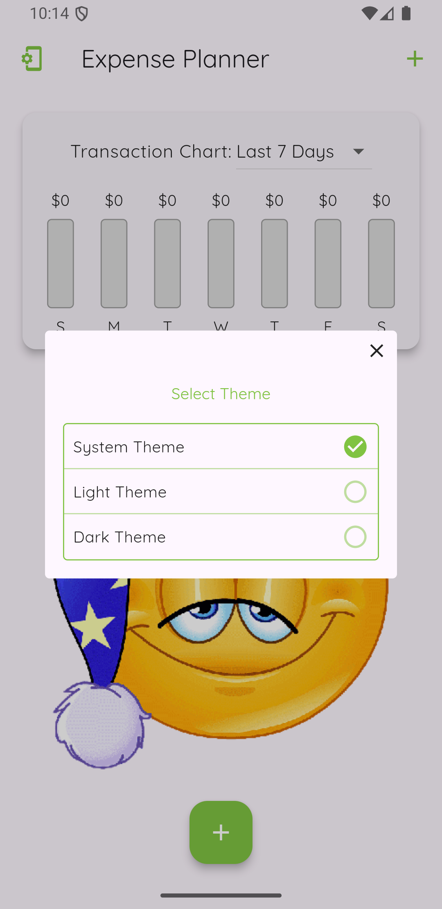
</td>
</tr>

**Landscape Main Screen**

 

<tr>
<td>
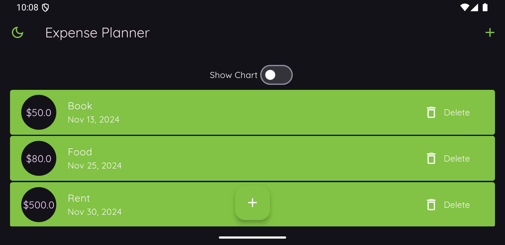
</td>
<td>
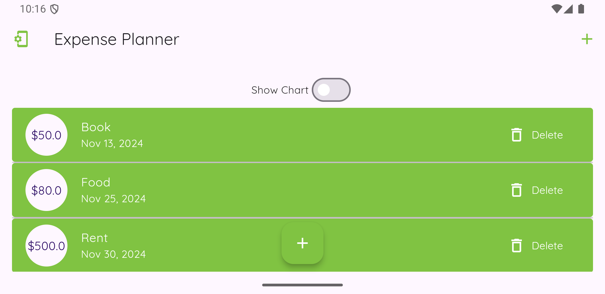
</td>
</tr>

**Landscape Chart View Screen**
 

<tr>
<td>
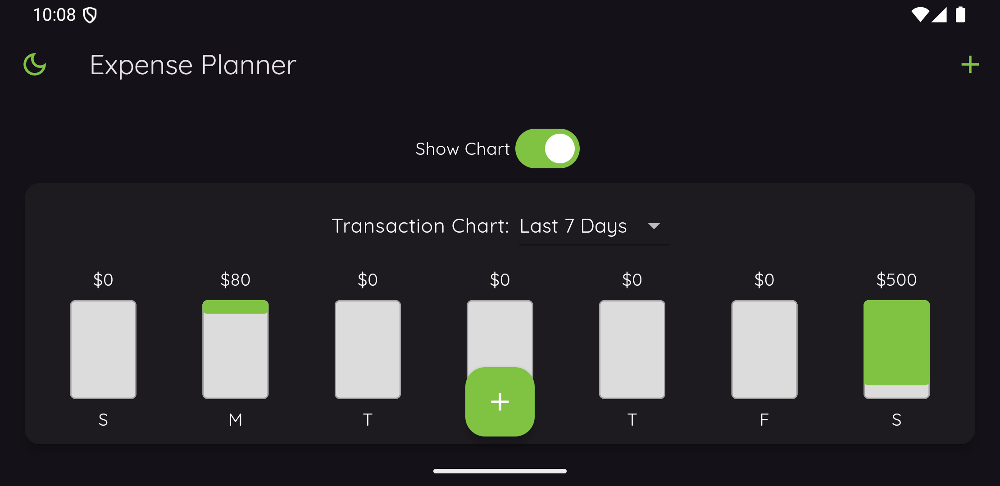
</td>
<td>
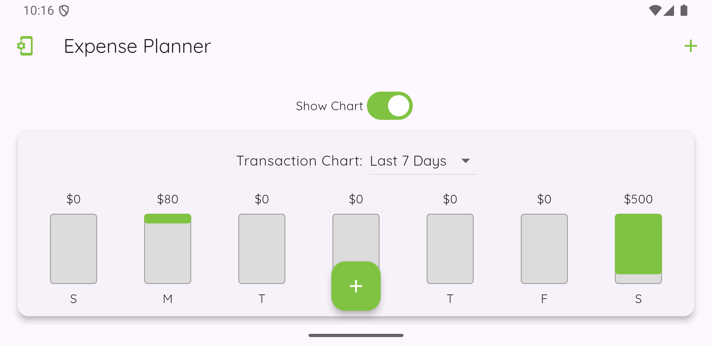
</td>
</tr>
