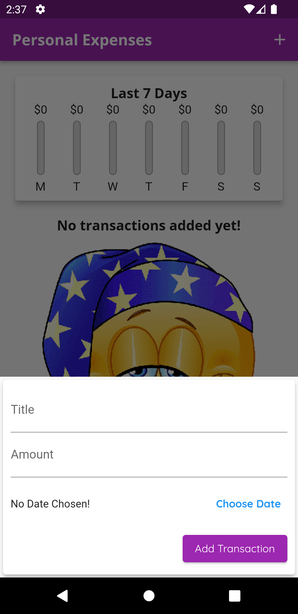
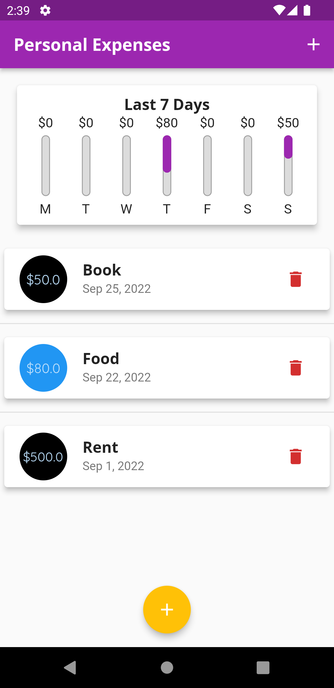
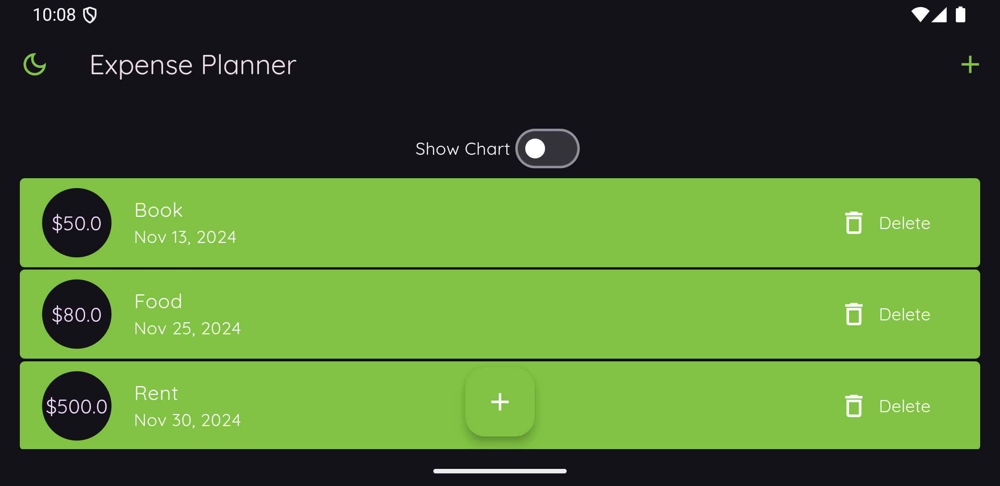
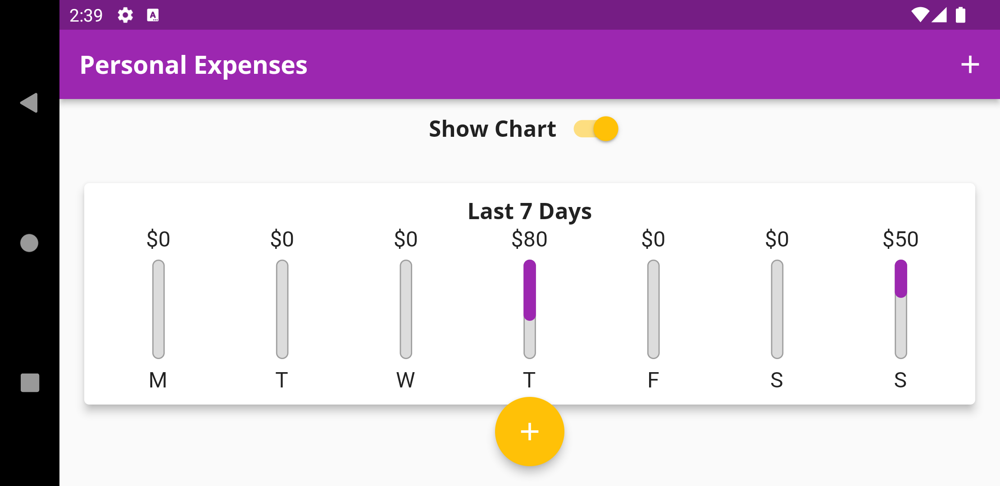

# Expense Planner

A new Flutter project.

**Features:**

- Save Data to Local Storage
- Last Week Expense Chart

**Packages we are using:**

- intl: [link](https://pub.dev/packages/intl)
- sqflite: [link](https://pub.dev/packages/sqflite)

Our Calculator app contains single screen and a special feature of saving every equation history.User can clear the history any time they want.

This is a complete functional calculator app that works on both Android and iOS devices. For state management, we use the provider package.

# Expense Planner App Final UI

**Home Screen**

**Input Screen**
 

**Data View Screen**
 

**Landscape Main Screen**
 

**Landscape Chart View Screen**
 

